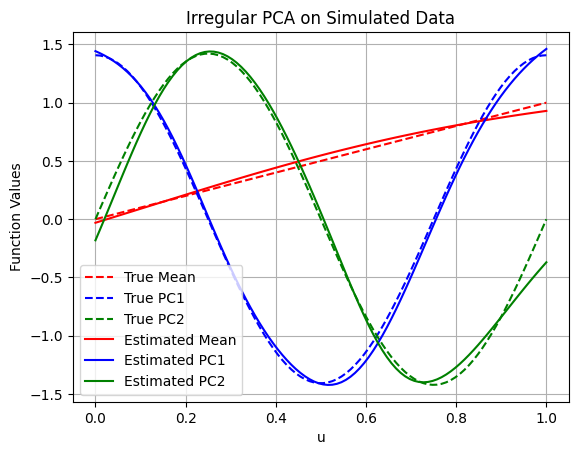

# IrregPCA: A fast and flexible approach for PCA with irregularly observed data

The package is based on a risk minimization methodology which minimizes a proper loss function derived from the [Eckhart-Young-Mirsky theorem](https://en.wikipedia.org/wiki/Low-rank_approximation#Basic_low-rank_approximation_problem) for the Hilbert-Schmidt norm. 

## Problem Statement

Let $( X(u): u \in \mathcal{U} )$ be a stochastic process on the domain $\mathcal{U} \subset \mathbb{R}^{d}$ equipped with the probablity measure $\mu$. We are given observations $Y_{ij} = X_{i}(U_{ij}) + \xi_{ij}$ for $j \in [n_{i}]$ where $i \in [n]$ where 

1. **Samples.** $(X_{i})_{i=1}^{n}$ are independently drawn from $X$,
2. **Locations.** $(U_{ij}: : j \in [n_{i}])_{i=1}^{n}$ are independently distributed on $\mathcal{U}$ according to $\mu$, and
3. **Noise.** $(\xi_{ij}: j \in [n_{i}])_{i=1}^{n}$ are independent random variables with mean zero and bounded variance.

Define $\boldsymbol{C}$ as the integral operator $\boldsymbol{C} f(v) = \int C(u, v) f(u) d\mu(u)$ where $C$ is the covariance function of $X$. Principal components analysis is essentially estimating the first $k$ eigenpairs $(\lambda_{j}, \boldsymbol{e} _{j})_{j=1}^{k}$ called the principal values and directions of $\boldsymbol{C}$ which are given by $\boldsymbol{C} \boldsymbol{e} _{j} = \lambda_{j} \boldsymbol{e} _{j}$.

## Methodology 

The method is based on sequentially minimizing the empirical version of the functional

$$
     -\sum_{j=1}^{k} \langle f_{j}, \boldsymbol{C}f_{j}\rangle + \frac{1}{2}\sum_{i,j=1}^{k} |\langle f_{i}, f_{j} \rangle|^{2}
$$

over $ (f_{j})_{j=1}^{k} $ derived by replacing $ \langle f, \boldsymbol{C}f \rangle $ with its unbiased estimator 

$$
 \hat{\boldsymbol{C}}[f, f] = \frac{1}{n} \sum_{i= 1}^{n} \left[ 
        \sum_{\substack{p, q = 1\\ p \neq q}}^{n_i} \frac{f(U_{ip}) f(U_{iq}) Y_{ip} Y_{iq}}{n_i (n_i-1)}\right] 
        - \frac{1}{n(n-1)}\sum_{\substack{i, j = 1\\ i \neq j}}^{n} \left[\sum_{p=1}^{n_i} \frac{f(U_{ip}) Y_{ip}}{n_i} \right]
        \left[\sum_{q=1}^{n_j} \frac{f(U_{jq}) Y_{jq}}{n_j} \right]  
$$

## Usage 

The instructions for usage are as follows:
1. Choose the number `k` of the leading principal directions that are desired,
2. Assemble the data $\mathscr{D} = ((i, U_{ij}, Y_{ij}): i \in [n], j \in [n_{i}])$ into a torch tensor `data` of shape `(d+2, N)` where `N` denotes the total number of observations. The first column `data[0, :]` contains the sample IDs $i$, the last column `data[-1, :]` contains the observations $Y_{ij}$ and the rest `data[1:-1, :]` are the coordinates of the locations $U_{ij}$.
3. Run 
``` 
models, loss_train, loss_valid = IrregPCA(k, data, device=None, epochs=600, lr=1e-3, patience=300, on_epoch=None)
```
to get the principal functions $\boldsymbol{f}_{j} = \lambda_{j}\boldsymbol{e}_{j}$ as neural network models `models[j]` for `j = 1, ..., k`. Note that `models[0]` is actually the estimated mean $\mathbb{E}[X]$ of $X$. The tensors `loss_train` and `loss_valid` contain the training and validation losses for every epoch over the training period.

Here is an illustration generated from 200 samples of 25 observations each.


## Installation

Install directly from GitHub:

```bash
pip install "git+https://github.com/kgwstat/IrregPCA.git"
```

For local development (editable install):

```bash
pip install -e .
```