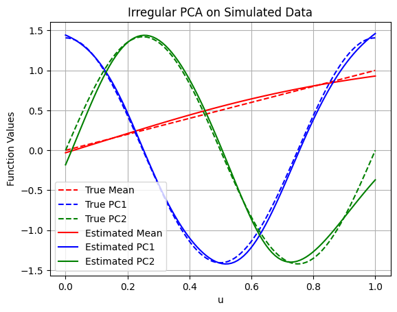

# IrregPCA: A fast and flexible approach for PCA with irregularly observed data

The package is based on a risk minimization methodology which minimizes a proper loss function derived from the [Eckhart-Young-Mirsky theorem](https://en.wikipedia.org/wiki/Low-rank_approximation#Basic_low-rank_approximation_problem) for the Hilbert-Schmidt norm. 

## Problem Statement

Let $( X(u): u \in \mathcal{U} )$ be a stochastic process on the domain $\mathcal{U} \subset \mathbb{R}^{d}$ equipped with the probablity measure $\mu$. We are given observations $Y_{ij} = X_{i}(U_{ij}) + \xi_{ij}$ for $j \in [n_{i}]$ where $i \in [n]$ where 

1. **Samples.** $(X_{i})_{i=1}^{n}$ are independently drawn from $X$,
2. **Locations.** $(U_{ij}: : j \in [n_{i}])_{i=1}^{n}$ are independently distributed on $\mathcal{U}$ according to $\mu$, and
3. **Noise.** $(\xi_{ij}: j \in [n_{i}])_{i=1}^{n}$ are independent random variables with mean zero and bounded variance.

Define $C$ as the integral operator $C f(v) = \int C(u, v) f(u) d\mu(u)$ where $C$ is the covariance function of $X$. Principal components analysis is essentially estimating the first $k$ eigenpairs $(v_{j}, e_{j})_{j=1}^{k}$ called the principal values and directions of $C$ which are given by $C e_{j} = v_{j} e_{j}$.

## Methodology 

The method is based on sequentially minimizing the empirical version of the functional

$$
     -\sum_{j=1}^{k} \langle f_{j}, Cf_{j}\rangle + \frac{1}{2}\sum_{i,j=1}^{k} |\langle f_{i}, f_{j} \rangle|^{2}
$$

over $ (f_{j})_{j=1}^{k} $ derived by replacing $ \langle f, Cf \rangle $ with its unbiased estimator 

$$
 \hat{C}[f, f] = \frac{1}{n} \sum_{i= 1}^{n} \left[ 
        \sum_{\substack{p, q = 1\\ p \neq q}}^{n_i} \frac{f(U_{ip}) f(U_{iq}) Y_{ip} Y_{iq}}{n_i (n_i-1)}\right] 
        - \frac{1}{n(n-1)}\sum_{\substack{i, j = 1\\ i \neq j}}^{n} \left[\sum_{p=1}^{n_i} \frac{f(U_{ip}) Y_{ip}}{n_i} \right]
        \left[\sum_{q=1}^{n_j} \frac{f(U_{jq}) Y_{jq}}{n_j} \right]  
$$

## Usage

### Installation

Install directly from GitHub:

```bash
pip install "git+https://github.com/kgwstat/IrregPCA.git"
```

For local development (editable install):

```bash
pip install -e .
```

### Imports

```python
from irregpca import IrregPCA, IrregPCAResult, fit_irreg_pca
```

### Preparing input data

Assemble the data $\mathscr{D} = ((i, U_{ij}, Y_{ij}): i \in [n], j \in [n_{i}])$ into a torch tensor of shape `(N, d+2)` where `N` is the total number of observations. Each **row** is one observation:
- `data[:, 0]` — integer sample IDs $i$
- `data[:, 1:-1]` — $d$-dimensional location coordinates $U_{ij}$
- `data[:, -1]` — scalar observations $Y_{ij}$

For example, with `d = 1` (scalar locations) and `N = 4` observations across 2 samples:

```python
import torch

data = torch.tensor([
    [0, 0.10,  1.2],
    [0, 0.35,  0.7],
    [1, 0.20, -0.1],
    [1, 0.80,  0.4],
], dtype=torch.float32)
# N = 4, d = 1, data.shape == (4, 3)
# data[:, 0]  -> sample IDs [0, 0, 1, 1]
# data[:, 1]  -> locations
# data[:, -1] -> observations
```

Alternatively, split the inputs into three separate tensors:

```python
sample_ids = torch.tensor([0, 0, 1, 1], dtype=torch.float32)  # shape (N,)
locations  = torch.tensor([[0.10], [0.35], [0.20], [0.80]])    # shape (N, d)
values     = torch.tensor([1.2, 0.7, -0.1, 0.4])              # shape (N,)
```

### Fitting

**Using the estimator class (preferred):**

```python
est = IrregPCA(n_components=3, epochs=600, lr=1e-3, patience=300)

# packed input
result = est.fit(data=data)

# or split input
result = est.fit(sample_ids=sample_ids, locations=locations, values=values)
```

**Using the functional wrapper:**

```python
result = fit_irreg_pca(data=data, n_components=3)
```

### Accessing the fitted functions

The result object exposes the fitted mean function and principal component functions as neural network models:

```python
grid = torch.linspace(0, 1, 200).unsqueeze(-1)  # shape (200, 1)

# mean function E[X]
mu = result.mean(grid)           # shape (200,)

# first principal component function (0-based index)
phi1 = result.component(0, grid) # shape (200,)

# all component functions stacked
Phi = result.components(grid)    # shape (200, n_components)
```

The estimator also exposes the same methods directly after fitting:

```python
mu   = est.mean(grid)
phi1 = est.component(0, grid)
Phi  = est.components(grid)
```

The underlying fitted models are accessible via:

```python
result.mean_model        # torch.nn.Module for the mean
result.component_models  # list of torch.nn.Module, one per component
result.history           # LossHistory with joint and per-component losses
```

Here is an illustration generated from 200 samples of 25 observations each.

<div align="center">
     
</div>